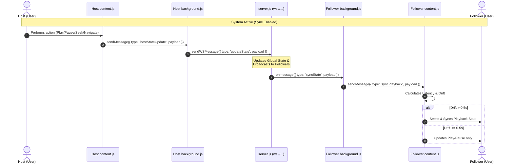
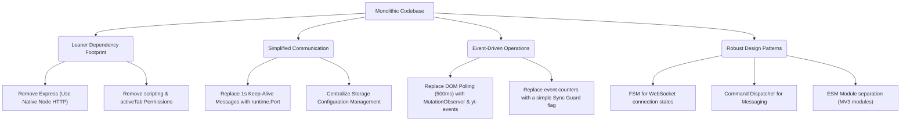
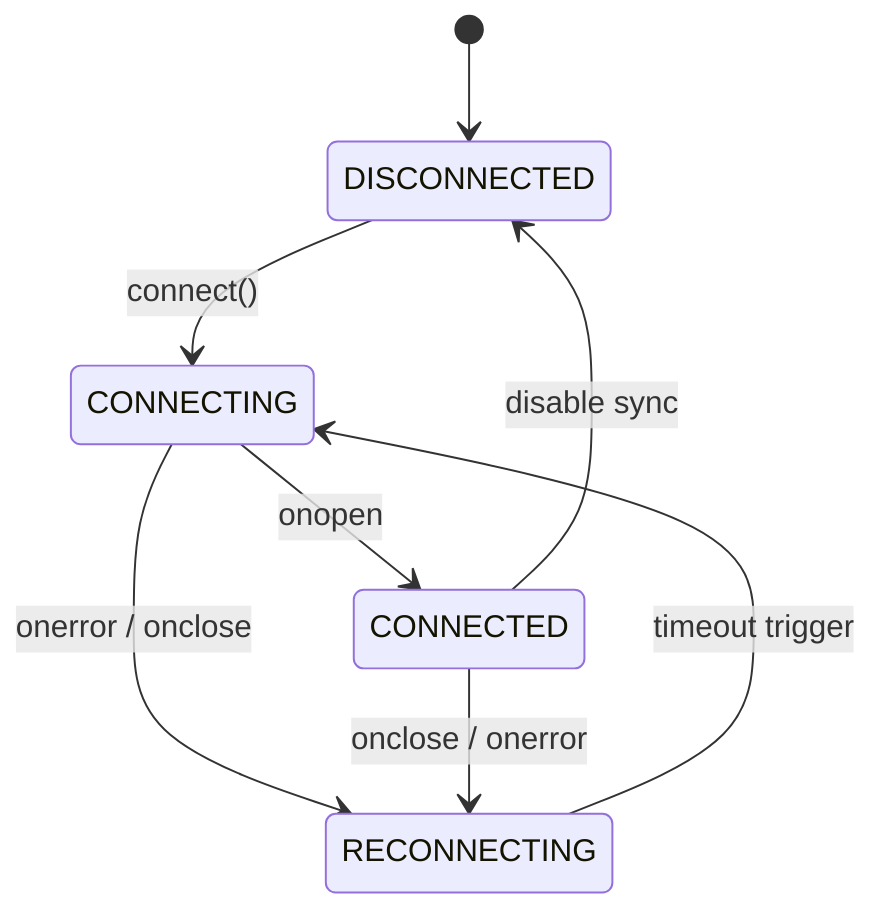

# 🎬 YouTube Sync Extension Documentation

A real-time Chrome Extension designed to synchronize YouTube video playback, navigation, and state (play, pause, seek) across multiple clients via WebSockets.

---

## 🏗️ Architecture Overview

The system uses a **Host-Follower** architecture coordinated through a centralized WebSocket server. The workflow utilizes three primary extension contexts and a server backend:



---

## 📁 Component Breakdown

The extension is split into three main components, each operating in a distinct sandbox:

| Component | Execution Context | Permissions Used | Primary Purpose |
| :--- | :--- | :--- | :--- |
| **Popup UI** (`popup.html` / `popup.js`) | Action click popup | `storage`, `tabs` | Provides the configuration UI to enable sync and toggle between Host and Follower roles. |
| **Background Script** (`background.js`) | Extension Service Worker | `storage`, `tabs` | Manages the persistent WebSocket connection, tracks the active syncing tab, and coordinates message routing. |
| **Content Script** (`content.js`) | YouTube Web Page DOM | None (Statically injected) | Hooks directly into the YouTube `<video>` element. Detects Host actions (play/pause/seek) and enforces playback state on Follower tabs. |

---

## 🛠️ Key Functions

The following table catalogs the core functions across the extension code. In the source code, these are annotated with `// MARK:` headings.

| Component | Function Name | Inputs | Description |
| :--- | :--- | :--- | :--- |
| `background.js` | `connect()` | *None* | Establishes the WebSocket connection to the server if synchronization is enabled, and registers the current role. |
| `background.js` | `setConnectionStatus(status)` | `status` (string) | Updates the local connection state variable and broadcasts a `statusUpdate` message to any open popup. |
| `background.js` | `sendWSMessage(data)` | `data` (object) | Encodes and sends a JSON message over the active WebSocket channel if it is open. |
| `background.js` | `handleFollowerSync(payload)` | `payload` (object) | Validates YouTube URLs, resolves the current sync tab (navigates or updates it), and forwards playback payloads to the page context. |
| `background.js` | `scheduleReconnect()` | *None* | Triggers exponential backoff reconnection logic (capped at 10s delay) when the WebSocket unexpectedly disconnects. |
| `background.js` | `startHeartbeat()` / `stopHeartbeat()` | *None* | Sets up/clears a 20-second interval timer that sends `ping` packets to prevent service worker idling. |
| `content.js` | `findVideoElement()` | *None* | Queries the YouTube DOM for the `<video>` player. Cache-stores it and registers DOM event listeners. |
| `content.js` | `setupEventListeners()` | *None* | Safely registers or re-binds play, pause, and seek event listeners on the HTML5 video element. |
| `content.js` | `sendHostState(trigger)` | `trigger` (string) | Gathers current video state (URL, paused/playing, current time) and messages the background worker. |
| `content.js` | `applyFollowerSync(payload)` | `payload` (object) | Executes play/pause commands and adjusts video playback time to match the Host, accounting for network latency. |
| `popup.js` | `setRole(newRole)` | `newRole` (string) | Stores the selected role in extension storage and updates the background connection. |
| `popup.js` | `updateRoleUI(activeRole)` | `activeRole` (string) | Applies active CSS classes to role buttons (Host vs Follower). |
| `popup.js` | `updateStatusUI(status)` | `status` (string) | Renders the connection status banner and online/offline indicator dot. |

---

## 📡 Important Event Listeners

Event listeners drive the reactive nature of the extension. Below is the list of crucial listeners and their duties:

### 1. Browser & Extension Event Listeners
*   `chrome.runtime.onMessage.addListener`
    *   **In `background.js`**: Listens for control messages from popup (like toggling sync, role changes, or registering the active tab) and state reports from host content scripts (`hostStateUpdate`).
    *   **In `content.js`**: Listens for `syncPlayback` events sent by the background service worker when a new host state broadcast arrives.
    *   **In `popup.js`**: Listens for connection state updates (`statusUpdate`) pushed from the background script to refresh the UI.
*   `chrome.tabs.onUpdated.addListener`
    *   **In `background.js`**: Detects when the Follower's synced tab finishes reloading or navigates (`changeInfo.status === 'complete'`). Updates active sync tab registration and enforces host URL redirection if a follower navigates away.
*   `chrome.tabs.onRemoved.addListener`
    *   **In `background.js`**: Listens for the syncing tab being closed. Immediately turns synchronization OFF, terminates the WebSocket connection, and resets active state globally.
*   `DOMContentLoaded`
    *   **In `popup.js`**: Triggered when the popup UI is opened. Loads settings from `chrome.storage.local`, updates UI buttons, queries the active tab to show alerts/warning notice on non-YouTube tabs, and checks connection health.

### 2. DOM & Video Element Event Listeners (Host Mode)
*   `video.addEventListener('play')` & `video.addEventListener('pause')`
    *   **In `content.js`**: Fired when the Host plays or pauses the YouTube video. Captures the state change immediately and sends a sync message.
*   `video.addEventListener('seeked')`
    *   **In `content.js`**: Triggered when the Host scrubs or seeks to a different timestamp. Immediately sends the new progress time to ensure Followers match the position.
*   `document.addEventListener('yt-navigate-finish')`
    *   **In `content.js`**: A custom YouTube-specific SPA navigation event. Fired when the Host transitions to a new video page, triggering an immediate state evaluation.

### 3. WebSocket Event Listeners
*   `ws.onopen`
    *   **In `background.js`**: Fired when connection succeeds. Initiates the role handshake and heartbeat timers.
*   `ws.onmessage`
    *   **In `background.js`**: Receives state updates from the server. If the client is a Follower, it invokes `handleFollowerSync`. If the server warns `roleDemoted`, it updates local storage.
*   `ws.onclose` & `ws.onerror`
    *   **In `background.js`**: Fired when the connection fails. Stops heartbeats and schedules a reconnection sequence.

---

## ⏱️ Synchronization Math & Drift Control

To avoid infinite loops and stuttering on the Follower's screen, `content.js` does not blindly seek the video to the Host's exact timestamp. It employs a **drift threshold** and accounts for **network latency**:

```javascript
// Calculate network latency between Host state capture and Follower execution
const referenceTime = sentAt || updatedAt;
const latencySeconds = (Date.now() - referenceTime) / 1000;

// Projected timestamp where the Host video is at this instant
let targetTime = currentTime + latencySeconds;

// Evaluate difference between local play position and target
const drift = Math.abs(video.currentTime - targetTime);

// Enforce seeking only if drift is significant (greater than 0.5s)
if (drift > 0.5) {
  video.currentTime = targetTime;
}
```

> [!NOTE]
> Setting the drift threshold to **0.5 seconds** strikes a balance between keeping video playback tight and preventing choppy video seeking due to micro-variations in network speed.

---

## ⚡ Service Worker Keep-Alive Strategy

Under Manifest V3, background scripts run as Service Workers which are automatically terminated by Chrome after periods of inactivity. To prevent the extension from going offline, a **dual keep-alive cycle** is used:

1.  **Heartbeat Pings (Background → Server)**: Every 20 seconds, the background script sends a light JSON `{ type: 'ping' }` packet to the WebSocket server. Running this keeps the WebSocket connection open and alerts Chrome that the worker is actively handling network tasks.
2.  **Connection Port Keep-Alive (Content Script → Background)**: Active synced tabs establish a long-lived Port connection (`chrome.runtime.connect`) with `background.js`. Under Manifest V3, an active port connection natively keeps the service worker active without needing high-frequency message polling.

---

## 🛠️ Codebase Refactoring & Optimization Plan

This section details a comprehensive technical roadmap for making the codebase significantly leaner, simplifying complex components, applying design patterns, and implementing modern coding practices, while preserving identical functional behavior.

### 📋 Optimization Summary



---

### 1. Dependency Optimization (Leaner Server)
> [!TIP]
> **Express** is a large dependency for a service whose only HTTP function is returning a static health status.

*   **Problem**: The server codebase relies on Express to spin up a server and handle a single `/health` check endpoint. This introduces overhead, enlarges `node_modules`, and extends start-up latency.
*   **Refactoring Plan**: Remove `express` from `package.json` entirely. Utilize Node's native `http` module to intercept requests and respond to the `/health` endpoint.
*   **Code Comparison**:
    ```javascript
    // BEFORE (Express)
    const express = require('express');
    const app = express();
    app.get('/health', (req, res) => {
      res.json({ status: 'ok', hasHost: !!hostSocket, clientsCount: wss.clients.size });
    });
    
    // AFTER (Zero-Dependency Native HTTP)
    const http = require('http');
    const server = http.createServer((req, res) => {
      if (req.url === '/health' && req.method === 'GET') {
        res.writeHead(200, { 'Content-Type': 'application/json' });
        res.end(JSON.stringify({ 
          status: 'ok', 
          hasHost: !!hostSocket, 
          clientsCount: wss.clients.size 
        }));
      } else {
        res.writeHead(404);
        res.end();
      }
    });
    ```

---

### 2. Permission Reduction & Tab Management (Leaner Extension)
> [!IMPORTANT]
> Reducing required permissions is highly recommended for security audits and faster Chrome Web Store approvals.

*   **Problem**: The extension injects the content script dynamically using `chrome.scripting.executeScript`. This forces the extension to request intrusive `"scripting"` and `"activeTab"` permissions in `manifest.json`. It also results in complex focus trackers and manual script-injection handlers in `background.js` (approx. 80 lines of code) which are prone to timing bugs on fast navigation.
*   **Refactoring Plan**:
    *   Register `content.js` statically in `manifest.json` under `content_scripts` matching `*://*.youtube.com/*`.
    *   Remove `"scripting"` and `"activeTab"` permissions from `manifest.json`.
    *   Make `content.js` completely passive if synchronization is disabled by checking storage upon injection:
        ```javascript
        const { enabled = false } = await chrome.storage.local.get('enabled');
        if (!enabled) return;
        ```
    *   **Delete** the tab trackers, `handleTabActivationOrUpdate`, and `chrome.tabs.onActivated` listeners inside `background.js`. Chrome will handle injection natively, cleanly, and securely.

---

### 3. Event-Driven Keep-Alive (Simplification & Performance)
*   **Problem**: To prevent Manifest V3 Service Worker termination, `content.js` pings the background script using `chrome.runtime.sendMessage` every **1 second** (`CONFIG.KEEP_ALIVE_INTERVAL = 1000`). This generates massive message noise, forces the background worker to consume CPU cycles constantly, and degrades device battery life.
*   **Refactoring Plan**: Replace the periodic message-passing interval with Chrome's native connection-oriented API (`chrome.runtime.connect`).
    *   Have `content.js` open a persistent port connection:
        ```javascript
        const port = chrome.runtime.connect({ name: 'yt-sync-keepalive' });
        ```
    *   In `background.js`, listen for the port connection:
        ```javascript
        chrome.runtime.onConnect.addListener((port) => {
          if (port.name === 'yt-sync-keepalive') {
             // Worker remains active while port is open. No 1-second pings needed!
          }
        });
        ```
    *   If Chrome terminates the worker (due to the maximum 5-minute port lifetime limit), the content script catches the `port.onDisconnect` event and immediately reconnects. This achieves the exact same keep-alive status while reducing messaging overhead by **99.7%** (from 300 messages to 1 message every 5 minutes).

---

### 4. Replacing DOM Polling with Reactive Observers (Simplification)
*   **Problem**: `content.js` queries the DOM for the YouTube `<video>` tag every **500ms** to check if it exists, attach event listeners, and trigger follower synchronization. This introduces constant CPU overhead on active tabs.
*   **Refactoring Plan**: Replace continuous interval polling with a reactive strategy:
    1.  Perform an instant DOM query for `<video>` on load. If found, bind events and exit.
    2.  If not found immediately (e.g. initial page loading state), instantiate a lightweight `MutationObserver` targeting the player container or `document.body`.
    3.  Once the observer detects the insertion of the `<video>` element, bind the listeners and immediately `disconnect()` the observer.
    4.  Hook into YouTube's SPA navigation events (`yt-navigate-finish`) to re-trigger a video query when transitioning to another video page.
    *   This eliminates the continuous `setInterval` loop entirely.

---

### 5. Architectural Separation of Concerns (ESM Modules)
> [!TIP]
> Under Manifest V3, background service workers support ES Modules natively by setting `"type": "module"`.

*   **Problem**: Both `background.js` (560+ lines) and `content.js` (610+ lines) are monoliths that blend network connections, UI management, calculations, storage handlers, and message routing.
*   **Refactoring Plan**: Decouple logic into discrete classes/modules:
    *   `ws-manager.js`: Handles WebSocket state, reconnect timeouts, and packet formatting.
    *   `time-sync.js`: Encapsulates NTP calculations, offset adjustments, and clock calibrations.
    *   `storage-manager.js`: Handles local storage, updates defaults, and broadcasts changes.
    *   `ui-toast.js`: (in content) Builds and injects warning overlays and demotion notifications.
    *   `video-controller.js`: (in content) Monitors playback state, tracks player events, and executes seeking.

---

### 6. Design Patterns implementation

#### A. Command / Message Dispatcher Pattern
Simplify the giant `if/else` and `switch` statements parsing message types in `chrome.runtime.onMessage.addListener`.
*   **Implementation**: Maintain a registry mapping message types directly to handler functions:
    ```javascript
    const MessageDispatcher = {
      handlers: {},
      register(type, handler) {
        this.handlers[type] = handler;
      },
      dispatch(message, sender, sendResponse) {
        const handler = this.handlers[message.type];
        if (handler) {
          handler(message, sender, sendResponse);
          return true; // Keep channel open for async responses
        }
        return false;
      }
    };
    ```

#### B. Finite State Machine (FSM) for WebSocket Lifecycle
*   **Implementation**: Define states `DISCONNECTED`, `CONNECTING`, `CONNECTED`, and `RECONNECTING`. Move all connection status updating, heartbeat timers, and reconnection schedules into a state machine context. This ensures that transitions (such as connection failures) automatically trigger correct cleanup routines without leaving orphaned intervals.



---

### 7. Simplifying Event Loops (Synchronization Guard)
*   **Problem**: To avoid feedback loops (e.g. Follower receives a "pause" command from Host, programmatically pauses the video, which fires the local "pause" event listener, triggering a redundant "pause" notification back to the server), the extension keeps track of `expectedProgrammaticActions` counters. These counters are highly vulnerable to dropping or duplicating events if browser rendering stutters.
*   **Refactoring Plan**: Implement a simple, foolproof synchronization guard variable (`isApplyingSync` boolean).
*   **Implementation**:
    ```javascript
    let isApplyingSync = false;
    
    // In video event listeners:
    function handleVideoEvent(e) {
      if (isApplyingSync) return; // Prevent local updates from being sent back
      sendHostState(e.type);
    }
    
    // In Follower state application:
    function applyFollowerSync(payload) {
      isApplyingSync = true;
      try {
        if (shouldPlay) video.play();
        if (shouldPause) video.pause();
        if (shouldSeek) video.currentTime = targetTime;
      } finally {
        // Let the current execution microtask stack clear before resetting
        setTimeout(() => { isApplyingSync = false; }, 50);
      }
    }
    ```

---

### 8. Coding Practices & Readability

*   **Variable Renaming for Math Clarity**:
    *   Rename the parameter `wsReceivedAt` in `content.js` to `hostSentAtServerTime`. Since the background script passes `adjustedReceivedAt` into it, calling it `wsReceivedAt` confuses developers into thinking it represents the local receipt time rather than the NTP-adjusted server-relative send time.
*   **Centralize Settings Defaults**:
    *   Create a single `config.js` containing defaults. Import it in `background.js`, `content.js`, and `options.js` to eliminate three separate duplicate declarations of config key lists and defaults.
*   **Use Modern Optional Chaining and Nullish Coalescing**:
    *   Clean up manual checks like `data.serverUrl && data.serverUrl !== SERVER_URL` and `settings[key] !== undefined ? settings[key] : DEFAULT_CONFIGS[key]` with modern nullish operators (e.g. `settings[key] ?? DEFAULT_CONFIGS[key]`).
