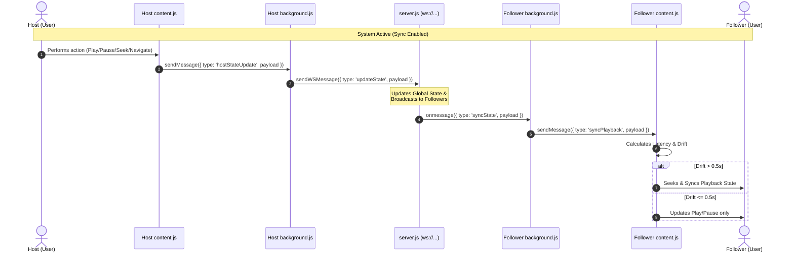

# 🎬 YouTube Sync Extension Documentation

A real-time Chrome Extension designed to synchronize YouTube video playback, navigation, and state (play, pause, seek) across multiple clients via WebSockets.

---

## 🏗️ Architecture Overview

The system uses a **Host-Follower** architecture coordinated through a centralized WebSocket server. The workflow utilizes three primary extension contexts and a server backend:



---

## 📁 Component Breakdown

The extension is split into three main components, each operating in a distinct sandbox:

| Component | Execution Context | Permissions Used | Primary Purpose |
| :--- | :--- | :--- | :--- |
| **Popup UI** (`popup.html` / `popup.js`) | Action click popup | `storage`, `tabs`, `scripting` | Provides the configuration UI to enable sync and toggle between Host and Follower roles. Handles initialization/script injection on the active tab. |
| **Background Script** (`background.js`) | Extension Service Worker | `storage`, `tabs`, `scripting` | Manages the persistent WebSocket connection, listens for external state changes, auto-injects scripts, and coordinates message routing. |
| **Content Script** (`content.js`) | YouTube Web Page DOM | None (Inherits tab access) | Hooks directly into the YouTube `<video>` element. Detects Host actions (play/pause/seek) and enforces playback state on Follower tabs. |

---

## 🛠️ Key Functions

The following table catalogs the core functions across the extension code. In the source code, these are annotated with `// MARK:` headings.

| Component | Function Name | Inputs | Description |
| :--- | :--- | :--- | :--- |
| `background.js` | `connect()` | *None* | Establishes the WebSocket connection to the server if synchronization is enabled, and registers the current role. |
| `background.js` | `setConnectionStatus(status)` | `status` (string) | Updates the local connection state variable and broadcasts a `statusUpdate` message to any open popup. |
| `background.js` | `sendWSMessage(data)` | `data` (object) | Encodes and sends a JSON message over the active WebSocket channel if it is open. |
| `background.js` | `handleFollowerSync(payload)` | `payload` (object) | Validates YouTube URLs, resolves the current sync tab (navigates or updates it), and forwards playback payloads to the page context. |
| `background.js` | `scheduleReconnect()` | *None* | Triggers exponential backoff reconnection logic (capped at 10s delay) when the WebSocket unexpectedly disconnects. |
| `background.js` | `startHeartbeat()` / `stopHeartbeat()` | *None* | Sets up/clears a 20-second interval timer that sends `ping` packets to prevent service worker idling. |
| `content.js` | `findVideoElement()` | *None* | Queries the YouTube DOM for the `<video>` player. Cache-stores it and registers DOM event listeners. |
| `content.js` | `setupEventListeners()` | *None* | Safely registers or re-binds play, pause, and seek event listeners on the HTML5 video element. |
| `content.js` | `sendHostState(trigger)` | `trigger` (string) | Gathers current video state (URL, paused/playing, current time) and messages the background worker. |
| `content.js` | `applyFollowerSync(payload)` | `payload` (object) | Executes play/pause commands and adjusts video playback time to match the Host, accounting for network latency. |
| `popup.js` | `setRole(newRole)` | `newRole` (string) | Stores the selected role in extension storage and updates the background connection. |
| `popup.js` | `updateRoleUI(activeRole)` | `activeRole` (string) | Applies active CSS classes to role buttons (Host vs Follower). |
| `popup.js` | `updateStatusUI(status)` | `status` (string) | Renders the connection status banner and online/offline indicator dot. |

---

## 📡 Important Event Listeners

Event listeners drive the reactive nature of the extension. Below is the list of crucial listeners and their duties:

### 1. Browser & Extension Event Listeners
*   `chrome.runtime.onMessage.addListener`
    *   **In `background.js`**: Listens for control messages from popup (like toggling sync, role changes, or registering the active tab) and state reports from host content scripts (`hostStateUpdate`).
    *   **In `content.js`**: Listens for `syncPlayback` events sent by the background service worker when a new host state broadcast arrives.
    *   **In `popup.js`**: Listens for connection state updates (`statusUpdate`) pushed from the background script to refresh the UI.
*   `chrome.tabs.onUpdated.addListener`
    *   **In `background.js`**: Detects when the Follower's synced tab finishes reloading or navigates (`changeInfo.status === 'complete'`). It then programmatically injects `content.js` back into the tab since no static scripts are declared in `manifest.json`.
*   `chrome.tabs.onRemoved.addListener`
    *   **In `background.js`**: Listens for the syncing tab being closed. Immediately turns synchronization OFF, terminates the WebSocket connection, and resets active state globally.
*   `DOMContentLoaded`
    *   **In `popup.js`**: Triggered when the popup UI is opened. Loads settings from `chrome.storage.local`, updates UI buttons, queries the active tab to show alerts/warning notice on non-YouTube tabs, and checks connection health.

### 2. DOM & Video Element Event Listeners (Host Mode)
*   `video.addEventListener('play')` & `video.addEventListener('pause')`
    *   **In `content.js`**: Fired when the Host plays or pauses the YouTube video. Captures the state change immediately and sends a sync message.
*   `video.addEventListener('seeked')`
    *   **In `content.js`**: Triggered when the Host scrubs or seeks to a different timestamp. Immediately sends the new progress time to ensure Followers match the position.
*   `document.addEventListener('yt-navigate-finish')`
    *   **In `content.js`**: A custom YouTube-specific SPA navigation event. Fired when the Host transitions to a new video page, triggering an immediate state evaluation.

### 3. WebSocket Event Listeners
*   `ws.onopen`
    *   **In `background.js`**: Fired when connection succeeds. Initiates the role handshake and heartbeat timers.
*   `ws.onmessage`
    *   **In `background.js`**: Receives state updates from the server. If the client is a Follower, it invokes `handleFollowerSync`. If the server warns `roleDemoted`, it updates local storage.
*   `ws.onclose` & `ws.onerror`
    *   **In `background.js`**: Fired when the connection fails. Stops heartbeats and schedules a reconnection sequence.

---

## ⏱️ Synchronization Math & Drift Control

To avoid infinite loops and stuttering on the Follower's screen, `content.js` does not blindly seek the video to the Host's exact timestamp. It employs a **drift threshold** and accounts for **network latency**:

```javascript
// Calculate network latency between Host state capture and Follower execution
const referenceTime = sentAt || updatedAt;
const latencySeconds = (Date.now() - referenceTime) / 1000;

// Projected timestamp where the Host video is at this instant
let targetTime = currentTime + latencySeconds;

// Evaluate difference between local play position and target
const drift = Math.abs(video.currentTime - targetTime);

// Enforce seeking only if drift is significant (greater than 0.5s)
if (drift > 0.5) {
  video.currentTime = targetTime;
}
```

> [!NOTE]
> Setting the drift threshold to **0.5 seconds** strikes a balance between keeping video playback tight and preventing choppy video seeking due to micro-variations in network speed.

---

## ⚡ Service Worker Keep-Alive Strategy

Under Manifest V3, background scripts run as Service Workers which are automatically terminated by Chrome after periods of inactivity. To prevent the extension from going offline, a **dual keep-alive cycle** is used:

1.  **Heartbeat Pings (Background → Server)**: Every 20 seconds, the background script sends a light JSON `{ type: 'ping' }` packet to the WebSocket server. Running this keeps the WebSocket connection open and alerts Chrome that the worker is actively handling network tasks.
2.  **Activity Pings (Content Script → Background)**: Synced tabs run an interval in `content.js` that pings the background script every 10 seconds. This message-passing tells the background script to wake up or reconnect if the connection has dropped.
